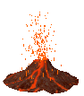

# Magma - abstraction layer to facilitate usage of Khronos Vulkan API

    

## Problem

Writing rendering stuff in Vulkan requires a lot of boilerplate code, unlike OpenGL and Direct3D 9.
This is the cost we pay for low-level and high-performant API, where we can control a lot of things
that previously only graphics driver was responsible for. Vulkan has very verbose interface where 
you have to initialize a lot of structures to get things work. This complicates fast prototyping,
makes your program error prone and hard to read and understand.

## Solutions

There are a lot of different C++ bindings, developed to simplify usage of Vulkan, including:

* [Vulkan-Hpp](https://github.com/KhronosGroup/Vulkan-Hpp) 
* [Anvil](https://github.com/GPUOpen-LibrariesAndSDKs/Anvil) 
* [V-EZ](https://github.com/GPUOpen-LibrariesAndSDKs/V-EZ) 
* [Vookoo](https://github.com/andy-thomason/Vookoo) 

and many others, but I've found that no one suitable for my purposes, because their implementations are 
different from my vision how such wrapper should be implemented and used. So eventually I decided to write my own.

## Design

Magma is all about initialization. It was designed with simplicity of object construction in mind.
Initialization exploit C++ RAII idiom with constructor overloading and default parameters that can be omitted.
Also library has a lot of pre-defined state objects, so developer can use them without initialization of custom states. 
With this approach construction of most complex Vulkan object - VkPipeline - takes only a dozen lines of code.

All objects are inherited from two types: Dispatchable and NonDispatchable, according to API specification. These types in turn
are inherited from base Object class. Render state objects are simply structures that inherited from Vulkan structures
and has plenty of constructors to conveniently initialize state description. They don't have any additional members,
so user can safely cast an array of state objects to an array of Vulkan structures. All state objects have ::hash() method,
which can be used to quickly lookup similar pipeline states in the cache instead of creating new one.

The library was designed with zero or almost zero overhead in mind. While C++ exceptions are heavily used during object
construction time, there are numerous methods marked with "noexcept" specifier. Consider, for example, VkCommandBuffer object:

* Most of wrapper's methods don't throw any exceptions.
* Parameters like smart pointers are passed by reference, so there is no reference counter increment/decrement.
* Thin methods around API calls are made inline. 

Command buffer's calls in release build should be as much efficient as native C API calls.

Predefined render states are usually "constexpr" objects, which means that they are initialized at compile-time
(not run-time), mapping efficiently to low-level API.

The library often allocates temporary arrays on the stack instead of creating them in the heap. This may cause stack overflow
in abuse cases, but speed up allocations and reduce memory fragmentation in run-time.

## Features

Magma was written mainly around [Vulkan 1.0](https://renderdoc.org/vkspec_chunked/index.html) specification, but has built-in support for some extensions:

* VK_AMD_rasterization_order
* VK_AMD_shader_core_properties
* VK_EXT_blend_operation_advanced
* VK_EXT_conditional_rendering
* VK_EXT_conservative_rasterization
* VK_EXT_debug_utils
* VK_KHR_device_group
* VK_KHR_display
* VK_NV_fill_rectangle
* VK_NV_raytracing

and some other minor extensions. Support for new API features (1.1 and beyond) not implemented.

## Auxiliary

Magma provides some auxiliary objects that were written on top of core functionality. Their goals are to facilitate development by providing
typical operations used in 3D graphics. For example, sometimes I miss immediate mode from OpenGL 1.x era, where you can quickly draw 
a few primitives with glBegin/glEnd. Or often there is need to quickly present rendered image to the screen, or create shader from GLSL source
instead of pre-compiled SPIR-V binary and so on. Auxiliary objects are placed in nested namespace and are not part of the Vulkan core.

## Dependencies

Library fully depends on STL and isn't designed to be used with custom containers. It doesn't use file input/output. There are no dependencies 
from any third-party libraries, except [shaderc](https://github.com/google/shaderc) - it's used (optionally) by ShaderCompiler.

## Language

Code is written in modern C++11/14 and takes advantage of new language features, STL containers and smart pointers.
