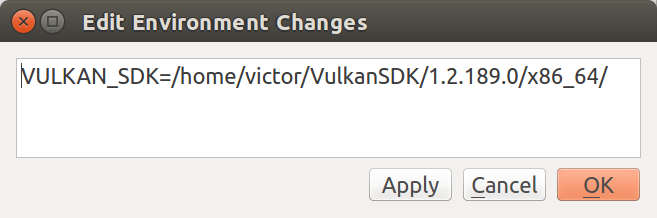

# Abstraction layer over Khronos Vulkan API

<p align="center">
    
</p>

## Problem

Writing rendering stuff in Vulkan requires a lot of boilerplate code, unlike OpenGL and Direct3D 9.
This is the cost we pay for low-level and high-performant API, where we can control a lot of things
that previously only graphics driver was responsible for. Vulkan has very verbose interface where 
you have to initialize a lot of structures to get things work. This complicates fast prototyping,
makes your program error prone and hard to read and understand.

## Solutions

There are a lot of different C++ bindings, developed to simplify usage of Vulkan, including:

* [Vulkan-Hpp](https://github.com/KhronosGroup/Vulkan-Hpp)<br>
* [Anvil](https://github.com/GPUOpen-LibrariesAndSDKs/Anvil)<br>
* [V-EZ](https://github.com/GPUOpen-LibrariesAndSDKs/V-EZ)<br>
* [Vookoo](https://github.com/andy-thomason/Vookoo)<br>

and many others, but I've found that no one suitable for my purposes, because their implementations are 
different from my vision how such wrapper should be implemented and used. So eventually I decided to write my own.

## Design

Magma is all about initialization. It was designed with simplicity of object construction in mind.
Initialization exploit C++ [RAII](https://en.wikipedia.org/wiki/Resource_acquisition_is_initialization) idiom with constructor overloading and default parameters that can be omitted.
Also library has a lot of pre-defined state objects, so developer can use them without initialization of custom states. 
With this approach construction of the most complex Vulkan object - VkPipeline - takes only a dozen lines of code.

All objects are inherited from two types: Dispatchable and NonDispatchable, according to API specification. These types in turn
are inherited from base Object class. Render state objects are simply structures that inherited from Vulkan structures
and has plenty of constructors to conveniently initialize state description. They don't have any additional members,
so user can safely cast an array of state objects to an array of Vulkan structures. All state objects have ::hash() method,
which can be used to quickly lookup similar pipeline states in the cache instead of creating a new one.

The library was designed with (almost) zero overhead in mind. While C++ exceptions are extensively used during object construction, 
numerous methods are marked with the  `noexcept` specifier to minimize compiler-generated stack unwinding code.

* Most of run-time methods don't throw any exceptions.
* A lot of arguments are passed through `lent_ptr` type that doesn't manage lifetime of the object and can accepts native, unique or shared pointer.
* The command buffer has a "lean and mean" implementation, designed for cases where near-zero overhead is essential.
* Thin methods around API calls are made inline.

Predefined render states are usually "constexpr" objects, which means that they are initialized at compile-time
(not run-time), mapping efficiently to low-level API.

The library usually allocates variable-length arrays (VLAs) on the stack instead of the heap. While this approach can lead to stack overflow in misuse scenarios, 
it significantly speeds up allocations and minimizes memory fragmentation at runtime.

## Reflection

Defining descriptor set layouts is usually one of the most complicated parts of the Vulkan API, often leading to tangled and hard-to-maintain code. 
Conceptually, this should be done using reflection between C++ and shader code. Reflection is a mechanism making it possible to investigate yourself.
In programming languages, reflection is used to access object properties and invoke methods in run-time. Magma uses Boost.PFR library to iterate over
fields of descriptor structure and SPIR-V reflection data. This approach allows descriptor set layouts to be defined as regular C++ structures and ensures their 
validity against specific shader bytecode. At runtime, you can assign resources (buffers, images, samplers, acceleration structures) to descriptor bindings, 
and they will be seamlessly attached to the shader when the descriptor set is bound via the command buffer.

## Memory management

While it is technically legal to create buffers and images without a custom memory allocator, it is highly encouraging to provide host and device memory allocators
during resource creation. Keep in mind that the number of memory allocations is limited by the implementation-defined value 
VkPhysicalDeviceLimits::maxMemoryAllocationCount. As a result, a per-object allocation approach is only suitable for small graphics applications.
Using a custom allocator enables sub-allocations from larger memory blocks, reducing memory fragmentation in dynamic scenarios. Magma provides an IDeviceMemoryAllocator interface,
allowing you to implement your own allocator or use the default one, which is built on top of the [Vulkan Memory Allocator](https://github.com/GPUOpen-LibrariesAndSDKs/VulkanMemoryAllocator).
Typically, the "allocator" parameter is the first among the default parameters passed to constructors, making construction expressions more concise and intuitive.

## Features

Magma was written mainly around Vulkan 1.0 specification, but has built-in support for some extensions, like ray-tracing, mesh shaders, transform feedback and some other minor extensions. 
There are a lot of mobile hardware that support only Vulkan 1.0, so it is better to have a wider range of compatible hardware rather than a questionable features.
Support for new API versions (1.1 and beyond) has not been implemented yet. Additionally, I have no plans to support extended dynamic states introduced in Vulkan 1.3, 
as they violate the core concept of Vulkan — everything should be pre-compiled before the render loop runs.

## Auxiliary

Magma provides some auxiliary objects that were written on top of core functionality. Their goals are to facilitate development by providing
typical operations used in 3D graphics. For example, sometimes I miss immediate mode from OpenGL 1.x era, where you can quickly draw 
a few primitives with glBegin/glEnd. Or often there is need to quickly present rendered image to the screen, or create shader from GLSL source
instead of pre-compiled SPIR-V binary and so on. Auxiliary objects are placed in nested `aux` namespace and are not part of the Magma core.

Some auxiliary objects use built-in precompiled shaders. Hash of a bytecode of these shaders calculated in compile-time to reduce loading overhead.

## Dependencies

There are dependencies from the following third party libraries:

* [shaderc](https://github.com/google/shaderc) - a collection of tools, libraries, and tests for Vulkan shader compilation.
* [SPIRV-Reflect](https://github.com/chaoticbob/SPIRV-Reflect) - a lightweight library that provides a C/C++ reflection API for SPIR-V shader bytecode in Vulkan applications.
* [Vulkan Memory Allocator](https://github.com/GPUOpen-LibrariesAndSDKs/VulkanMemoryAllocator) - Vulkan memory allocation library.
* [Boost.PFR](https://github.com/boostorg/pfr) - a C++14 library for very basic reflection that gives you access to structure elements.

Library depends on STL and has not been designed to be used with custom containers. It doesn't use any file input/output.

## Language

Code is written in modern C++11/14 and takes advantage of new language features.

Supported compilers:

* MSVC
* GCC
* Clang
* MinGW

## Build tools and SDK

### Ubuntu Linux

Install Git and Make (if not available):
```
sudo apt update
sudo apt install git
sudo apt install make
```
For Xlib, install X11 headers and libraries:
```
sudo apt install libx11-dev
```
For XCB:
```
sudo apt install xcb
sudo apt install libxcb-icccm4-dev
```

* [LunarG Vulkan SDK](https://www.lunarg.com/vulkan-sdk/)<br>

Go to the directory where .run file was saved:
```
chmod ugo+x vulkansdk-linux-x86_64-<version>.run
./vulkansdk-linux-x86_64-<version>.run
cd VulkanSDK/<version>/
source ./setup-env.sh
```
Check that Vulkan environment variables are present:
```
printenv | grep Vulkan
```
If you have error `glslangValidator': Permission denied` after running Make, go to `bin` directory of Vulkan SDK, and add executable permission to this file:
```
chmod +x glslangValidator
```

### MacOS

Download and install [Xcode IDE](https://developer.apple.com/xcode/). Apple ID may be required to use it.<br><br>
* [Getting Started with the macOS Vulkan SDK](https://vulkan.lunarg.com/doc/view/1.3.283.0/mac/getting_started.html)<br>

You need to properly configure VULKAN_SDK environment variable and make it visible to Xcode.<br>
Open **Terminal**, check that environment variable is present:
```
echo $VULKAN_SDK
```
If not, open zshrc file in Nano:
```
nano ~/.zshrc
```
Add environment variable:
```
export VULKAN_SDK=<you_path/VulkanSDK/1.x.xxx.x/macOS>
```
Press Ctrl-O/Ctrl-X to save changes and exit editor.<br>
With Xcode versions 7 and later, you may need to enable this behavior:
```
defaults write com.apple.dt.Xcode UseSanitizedBuildSystemEnvironment -bool NO
```
Run Xcode from terminal:
```
open -a Xcode
```

## Build instructions

### Windows

**Visual Studio** project is located in the `magma/projects/vs` directory.
If you are using Visual Studio older or newer than 2017 version, open project property page `Configuration Properties/General` 
and configure `Platform Toolset` property. It may be neccessary to adjust `Windows SDK Version` property too in the case if you get an error like this:
```
error MSB8036: The Windows SDK version 10.0 was not found. Install the required version of Windows SDK or change the SDK version in the project property pages or by right-clicking the solution and selecting "Retarget solution".
```

Also there is a command-line build option:

* Open **x64 Native Tools Command Prompt** (e.g. through Taskbar's Search box).
* Go to magma directory.
* Set DEBUG variable to choose between Debug or Release build, run **build** script.
```
set DEBUG=1
build
```
By default, debug version of static library is builded. If you want to build a release one, set DEBUG=0.
Build files are located in the `magma/projects/vs/x64/Debug(Release)` directory

### Linux

**Qt Creator** project is located in the `magma/projects/qt` directory.
To successfully compile the library, you need to setup path to Vulkan SDK as environment variable. 
Go to `Edit/Preferences` (or `Tools/Options`), open property page `Build and Run`, then select `Kits` tab.
Find `Environment` property, click "Change" button and add path to Vulkan SDK directory:

<p align="center">
    
</p>

To compile for specific platform, open magma.pro file, and add definition of the target platform, e.g.:

```
QMAKE_CXXFLAGS += -DVK_USE_PLATFORM_XCB_KHR
```

By default, Qt Creator uses only single CPU core, which slows down compilation significantly.
To enable multi-core compilation, select `Projects`, open `Build Settings` page, navigate to `Build Steps`
and set `Parallel jobs` value to the number of CPU threads you want to assign for compilation. For older
versions of Qt IDE, navigate to `Build Environment` section and add new variable `MAKEFLAGS -j<N>`, 
where N is the number of CPU threads you want to assign for compilation.

Also there is a command-line build option:

* Open terminal.
* Go to magma directory.
* Run **GNU Make**.
```
make DEBUG=1 -j<N>
```
where N is the number of CPU threads you want to assign for compilation.
By default, debug version of static library is builded, so DEBUG flag can be omitted. If you want to build 
a release one, explicitly specify DEBUG=0.

Vulkan supports different windowing system. By default, XCB is used. If you want to switch to Xlib, open Makefile and replace
```
PLATFORM=VK_USE_PLATFORM_XCB_KHR
```
with
```
PLATFORM=VK_USE_PLATFORM_XLIB_KHR
```
Other compositors like Wayland or XRANDR have not been tested.

### MacOS

**Xcode** project is located in the `magma/projects/xcode` directory. Open the project, go to `Build Settings`, find `System Header Search Paths` and check that VULKAN_SDK environment variable is resolved to actual path to Vulkan SDK.

## Examples

To test that all components of the library work as expected, I wrote a collection of samples that use Magma.
They are written in a cross-platform way (Windows/Linux) to make sure that library is able to work on all platforms.

You can find these samples here: [graphics](https://github.com/vcoda/basic-graphics-samples) and [ray-tracing](https://github.com/vcoda/basic-raytracing-samples).
